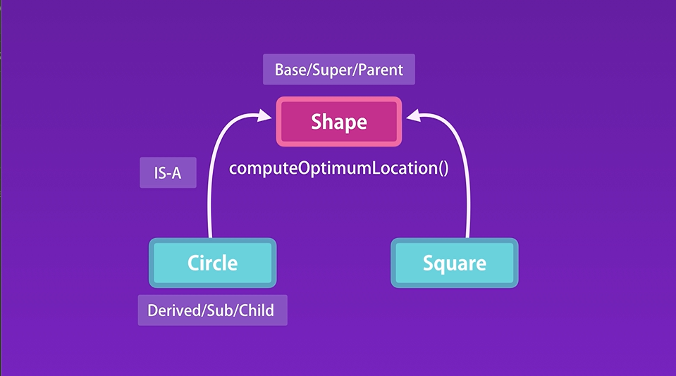
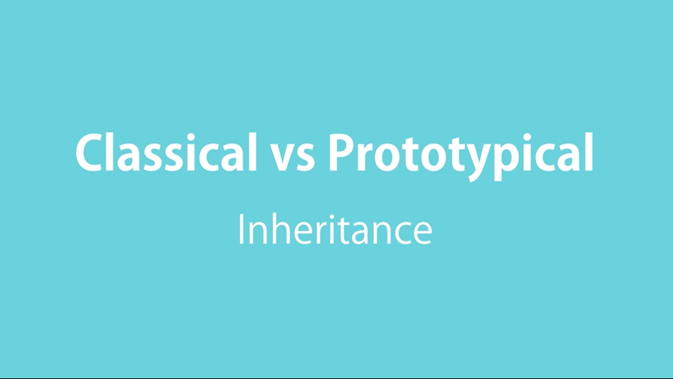
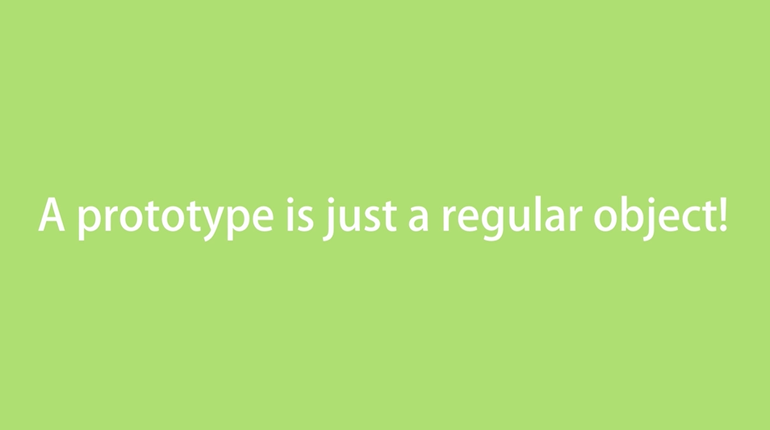
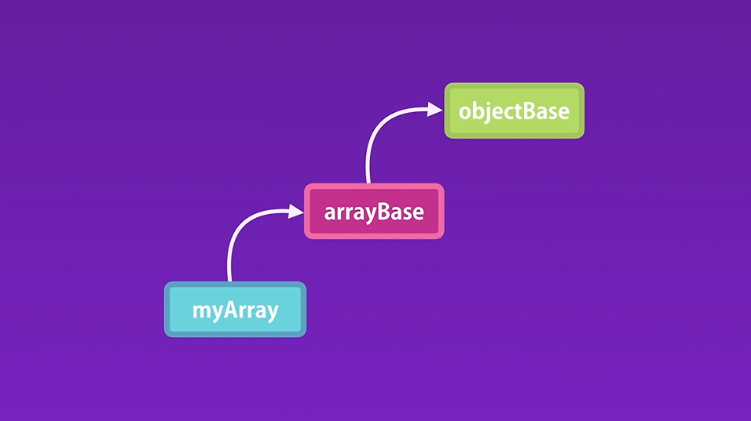
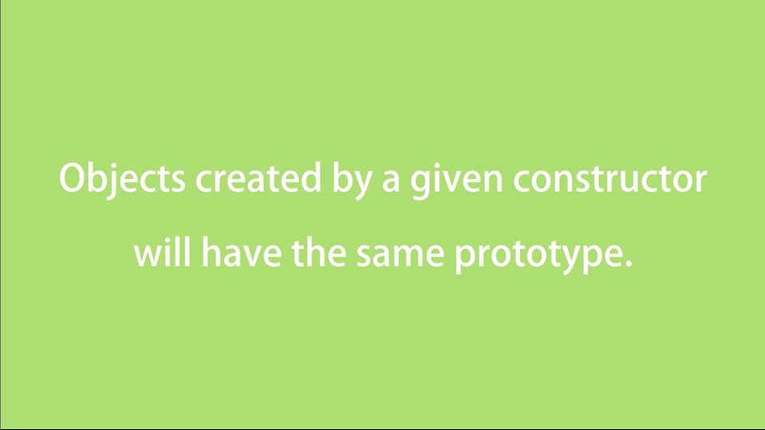
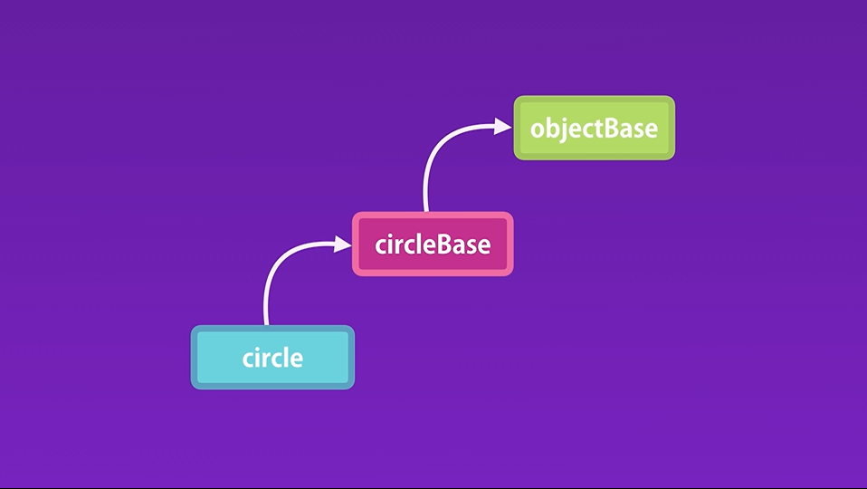
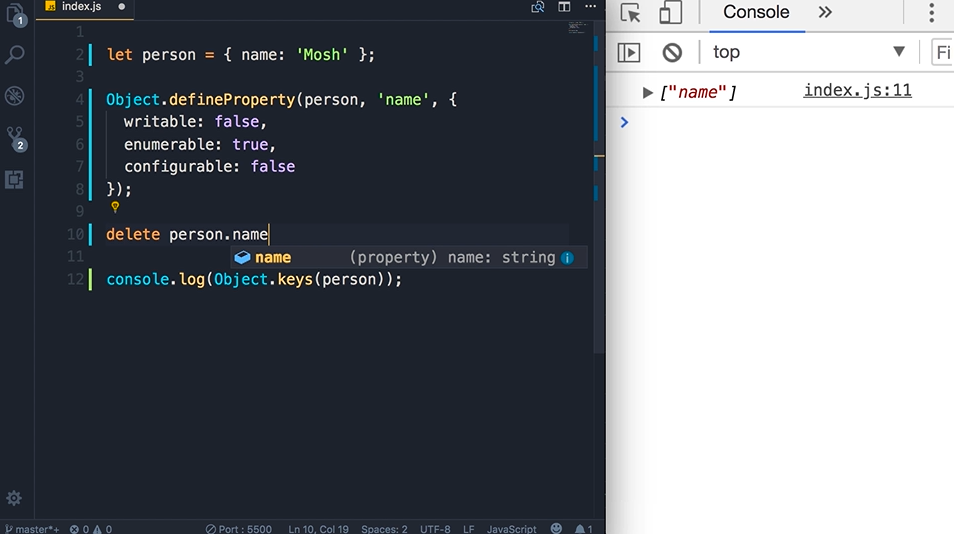
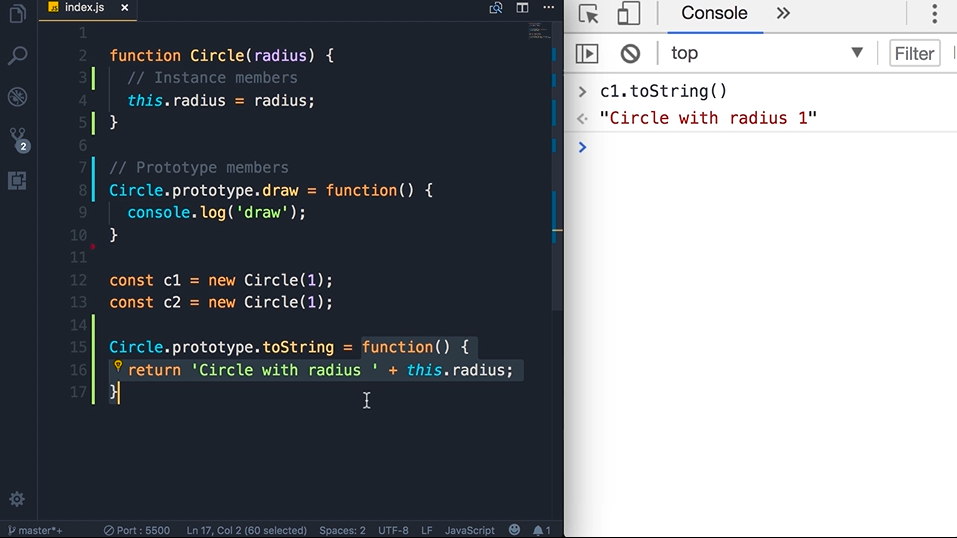
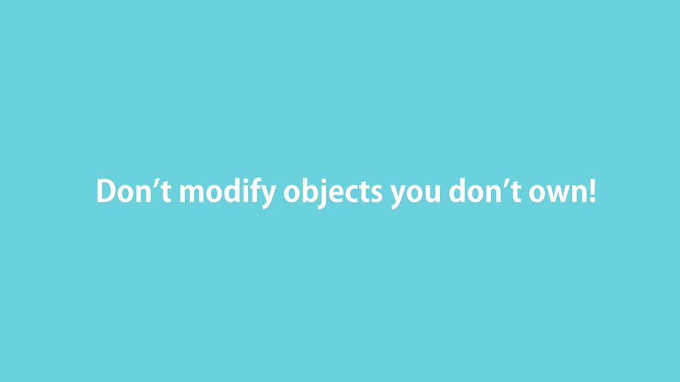

# Introduction

## Prototypical Inheritance
In Js, we dont have classes, we only have objects.

Prototype is actually a parent of the object. 

Objects inherit all the members from prototypes.

Evetry object in Js have prototype or parent except the root object that is objectBase. 

## Multilevel Inheritance

## Property Descriptors

## Constructor Prototypes

## Protoypes Vs Instance Member

Both these kind of members we can define others members

## Iterating Instance and Prototypes Members
Object.keys() only return instance members

For...in loops return all members(instance and prototype)

Instance also known as Own

## Avoid Extending Built-in Objects

