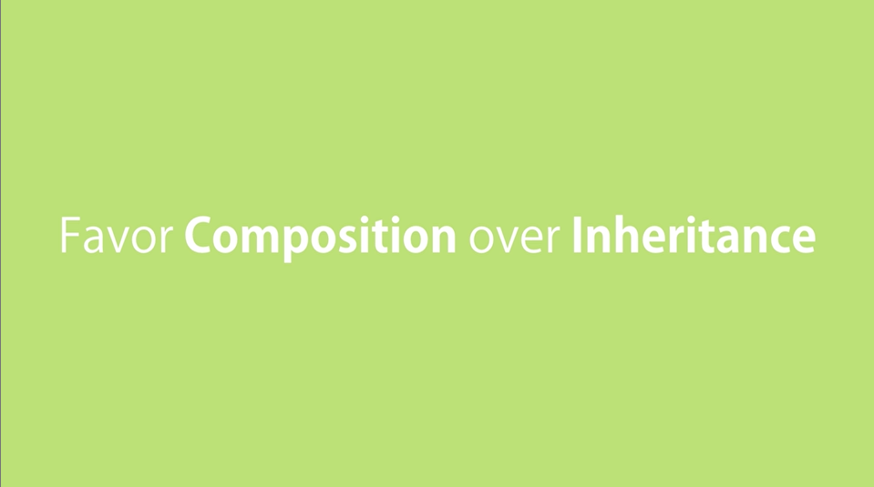

## Creating My Own Prototypical Inheritance

use Object.create();

## Resetting the constructor
Whenever we reset a prototypes, we reset the constructor as well

## Calling the Super Constructor

## Intermediate Function Inheritance

## Method Overriding
Override method that have been defined in a baseObject

Reimplementing method in a child object

## Polymorphism
Means Many Forms

## When to use Inheritance?
Composition also enables us to reuse code.

Because they are very fragile

## Mixins
