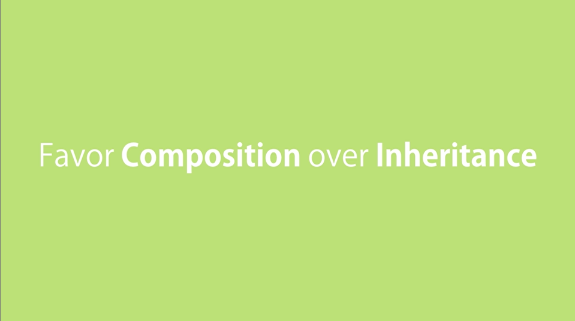
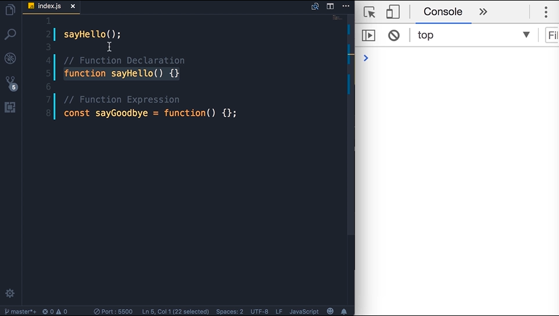
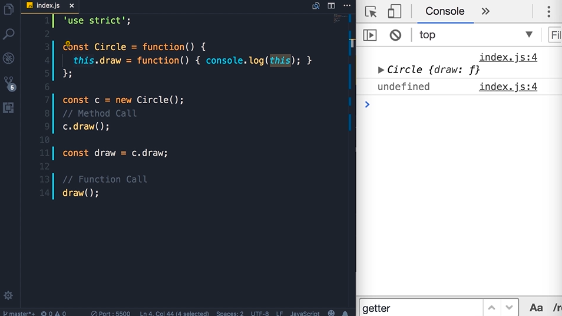
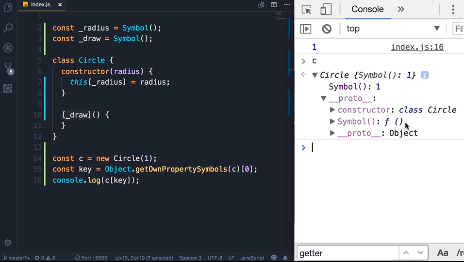
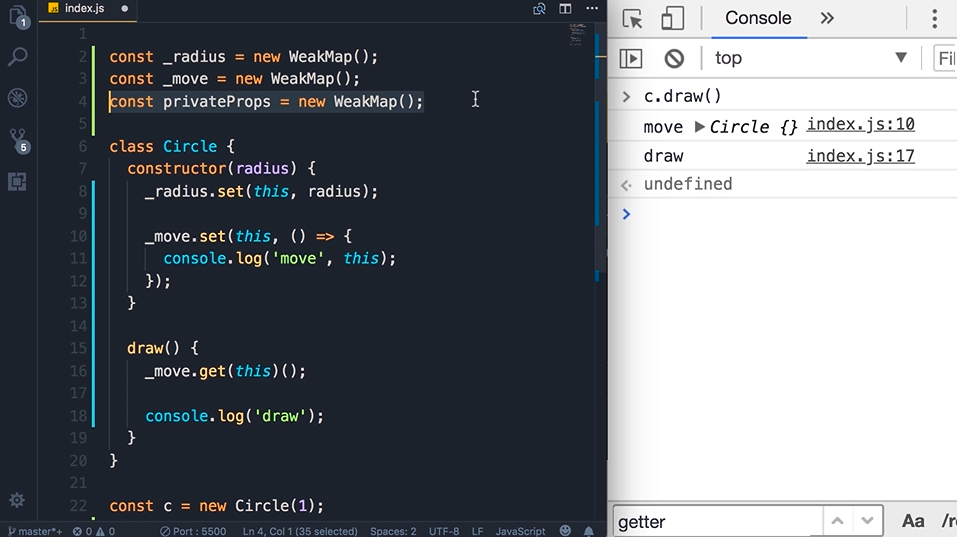
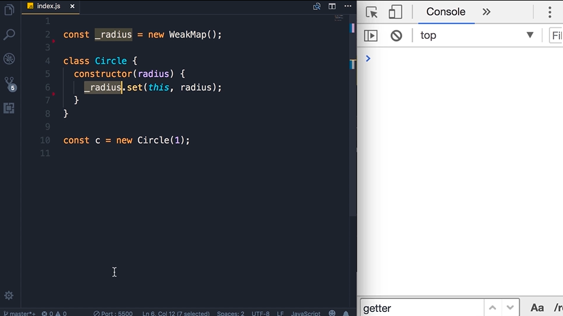
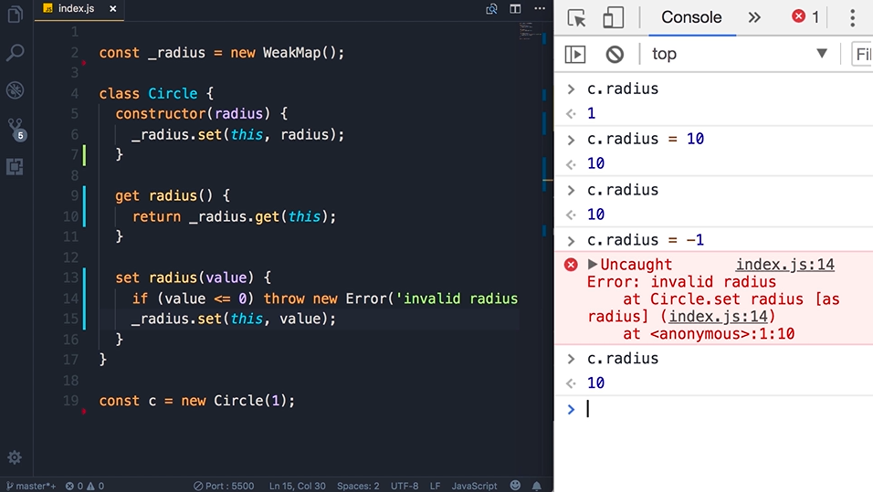

## Hoisting
In Js, 2 ways to define a function that are Function Declaration and Function Expression

Function Declaration are hoisted.Meaning that eventhough we call before defining the function, Js engine will move the function to top. In contrast, Function Exprssion is not hoisted

But in class, both Class Declaration and Class Expression are not hoisted.

## Static Methods
We use static methods to create a utility function that is not tied to a particular object.

## The This keyword
'strict mode'

## Private Properties Using Symbols
use Symbol() 

## Private Properties Using Weakmap

## Getters and Setters

## Inheritance

## Method Overriding

