# Basics

## Variables

We use varible to store data temporarily in computer memory.

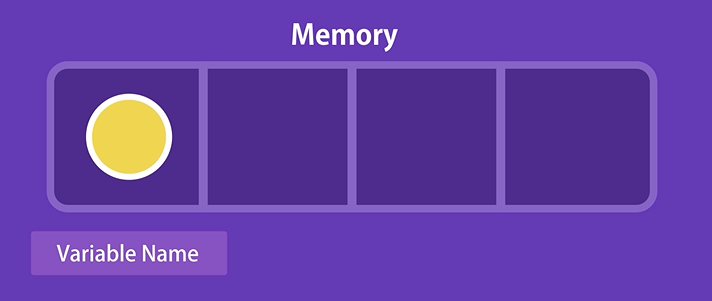

We store them and give them a name.

Previously we use var keyword to initialize a variable but there will be some issue if we use the keyword.

```
Js

let name = 'Syakir';
console.log(name);

// name cannot be a reserved keyword
// Should be meaningful
// Cannot start with a number(exp 1name)
// Cannot contain a space or hyphen (-)
// name are case-sensitive

let firstName;
// use camelCase notation

```

## Constants

```
Js

// This code will change the value from 0.3 to 1
let interestRate = 0.3;
interestRate = 1;
console.log(interestRate);

// So we use const to make the value fix. This code will output error on the console.
const interestRate = 0.3;
interestRate = 1;
console.log(interestRate);

```

## Primitive Types

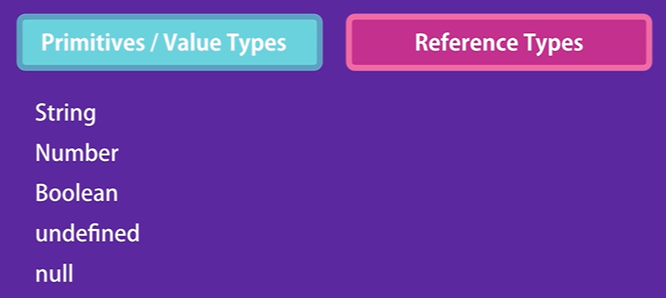

```
Js

let name = 'Syakir';
// String Literal

let age = 28;
// Number literal

let isApproved = false;
// Boolean literal

let firstName = undefined;
// if we don't initialize it it will be undefined by default

let selectedColor = null;
// Explicitly clear the value of the variable. Let say user choose a color and
// it will be the selectedColor but if user didnt select the choice would be none.
```

**ChatGPT: undefined vs null**

In programming, "null" and "undefined" are two distinct concepts used to represent the absence or lack of a value, but they are typically used in different contexts and have different meanings in various programming languages. Here's the difference between them:

**1. Undefined:**
   - **Context:** Undefined usually represents a variable or identifier that has been declared but has not been assigned a value.
   - **Origin:** It typically occurs when you declare a variable without initializing it, or when you try to access an object property that does not exist.
   - **Type:** In many programming languages, "undefined" is a special value or a type.
   - **Example (JavaScript):** In JavaScript, if you declare a variable without assigning a value, it will be undefined.

   ```javascript
   let x;
   console.log(x); // Output: undefined
   ```

**2. Null:**
   - **Context:** Null represents the intentional absence of any object value or a variable that has been explicitly set to "null" to indicate that it has no meaningful value.
   - **Origin:** You set a variable to null when you want to signify that it doesn't point to any valid object or data.
   - **Type:** Null is a specific value that indicates the absence of an object.
   - **Example (JavaScript):** You can explicitly set a variable to null in JavaScript.

   ```javascript
   let y = null;
   console.log(y); // Output: null
   ```

In summary, "undefined" typically occurs when you try to access something that hasn't been defined or initialized, whereas "null" is used when you want to explicitly indicate that a variable or object reference has no value or points to nothing. They are both used to handle situations where a variable or value lacks meaningful data, but they are used in slightly different contexts and for different purposes in programming.


## Dynamic Typing

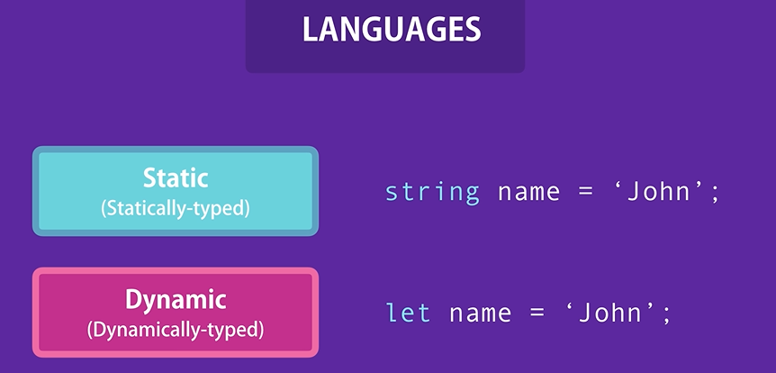

If we set a type of variable in a static proggramming language, we cannot change the type later.But we can do that in a dynamic language like Js. The value can be changed based on the value that we set on runtime.

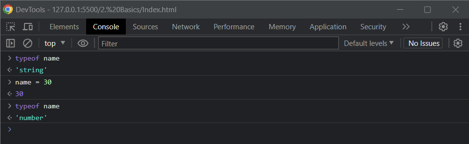

In Js we also dont have floating numbers. Despite in other language that have integer and floating number, all numbers in Js is type of number.

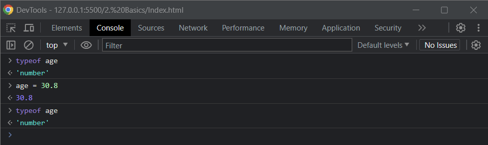

Undefined is a type but also a value.

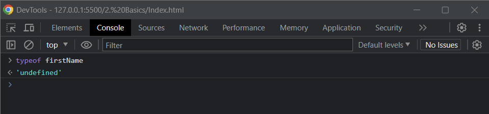

_Ctrl + L to clear the console_

## Objects

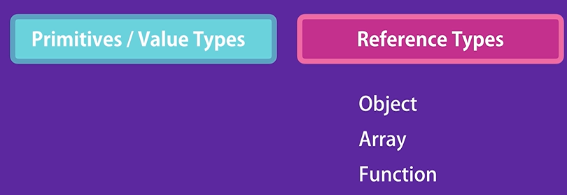

```
Js

let name = 'Syakir'; //This is variable
let age = 28;

let person = {}; //This is object literal syntax
// name and age is 2 key properties
// we add key = value pairs inside an object

let person= {
    name : 'Syakir',
    age : 28
};

console.log(person1);

```

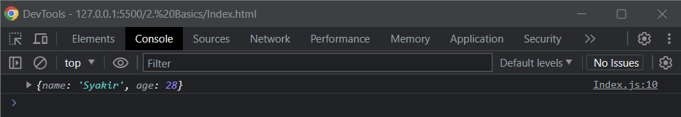

```
Js

let person= {
    name : 'Syakir',
    age : 28
};


// Now to access the object property we use :
// 1. Dot notation
person.name = 'Ket';

// 2. Square bracket notation.
// person ['name'] = 'Ket';

// We use when we dont know ahead of time the value of the property
// let selection = 'name';
// person[selection] = 'John';

console.log(person);
```

## Arrays

When we dealing with list of objects

```
Js

let selectedColors = []; //This square brackets is called array literal and is called empty array.

let selectedColors = ['red', 'blue'];
console.log(selectedColors);
```

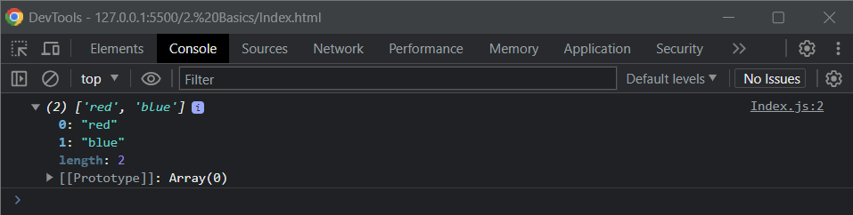

Arrays can be accessed by its index.
```
0: "red"
1: "blue"
```

Length of array can be increase or decrease. Type also dynamic and can be changed.So in arrays other programming language array must contains the same type,but in Js can mix type.

```
Js

let selectedColors = ['red', 'blue'];
selectedColors[2] = 'green';
console.log(selectedColors);
```

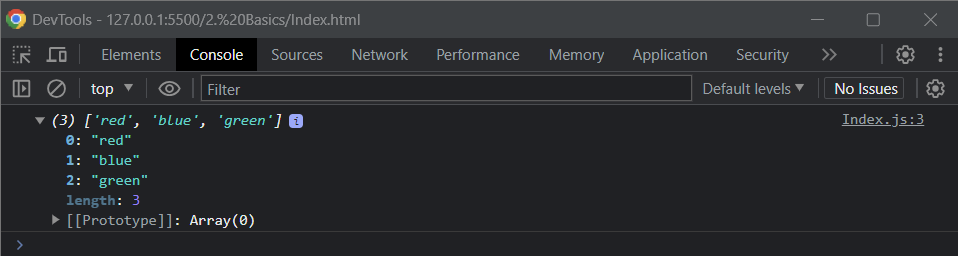

Technically an array is an object.

## Functions

A set of statements that perform a task or calculate a value.

```
Js

function greet() {} // This is function declaration syntax

function greet (name, lastName) //this holds parameter
{
    console.log('Hello ' + name + ' ' + lastName);
}

greet('Syakir'); //this holds argument
greet('Pokreh', 'Naka')
```

- A function can have inputs and that determines how the function behaves.
- Add a variable in the parenthesis (parameter) that only meaningful inside that function
- A function can have multiple parameter by separating with commas

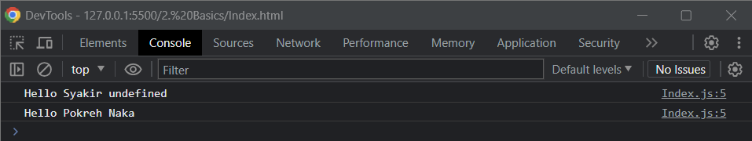

## Types of Functions

```
Js

// 1. To perform a task
function greet (name, lastName) {
    console.log('Hello ' + name + ' ' + lastName);
}

// To calculate and return a value
function square(number) {
    return number * number;
}

console.log(square(2));
// here we have 2 function calls (the one with the bracket).
// console.log();
// square();

```
