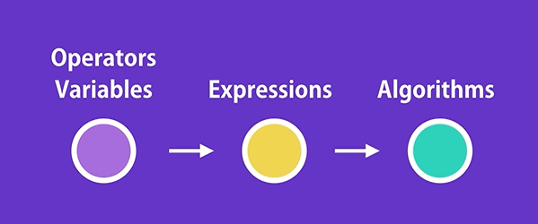
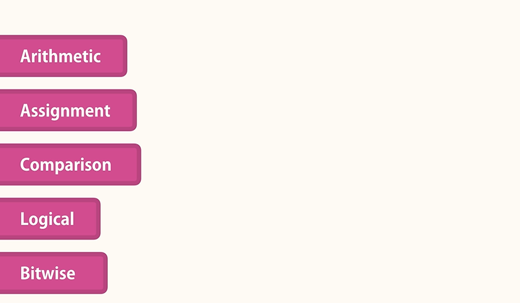
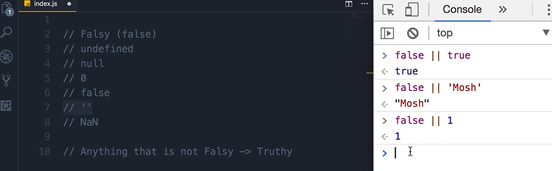
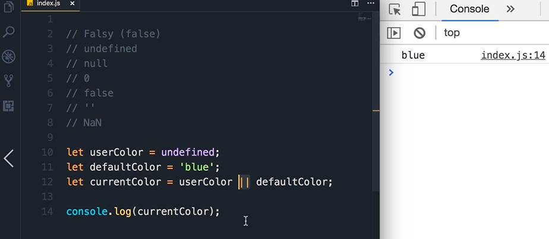
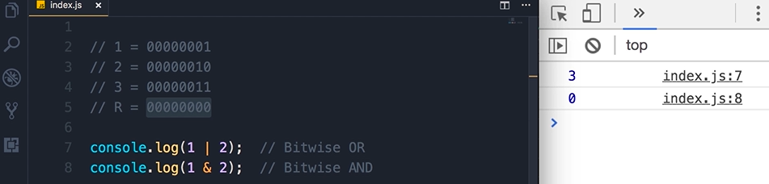
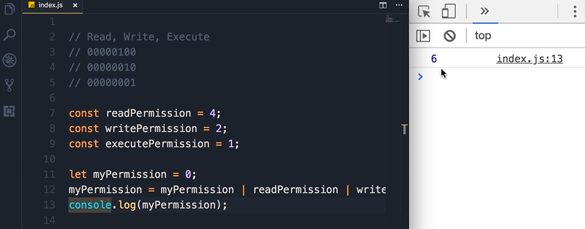
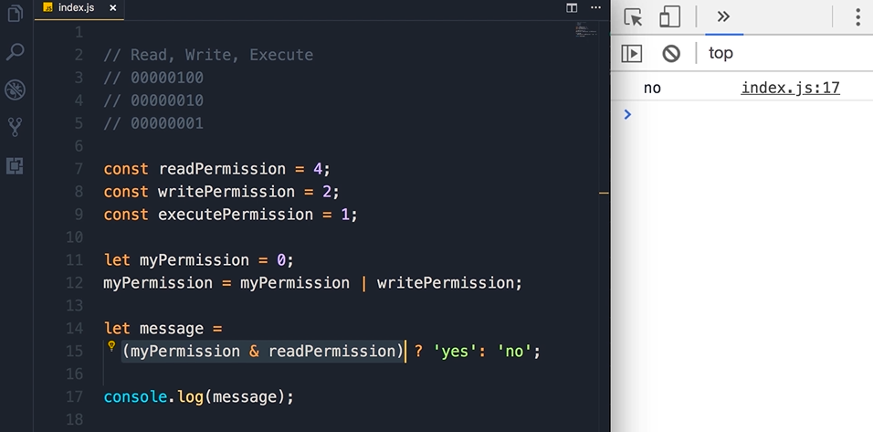
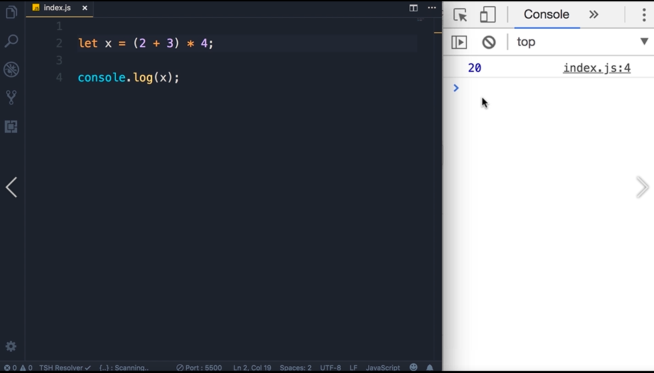

# Operators



We use Operators alongwith variables and constants to create expressions and with that expressions we can create logic and algorithms.



## Arithmetic

We use this expressions to run mathematical operations just like in math.

```
Js

let x = 10;
let y = 3;

console.log (x+y); //Addition
console.log (x-y); //Subtraction
console.log (x*y); //Multiplication
console.log (x/y); //Division
console.log (x%y); //Remainder of division
console.log (x**y); //Exponentiation

//Increment (++)
console.log(x++); //display on the console first then increment
console.log(++x); //increment first then display on the console.


// Decrement(--)
console.log(--x); //decrement first then display on the console.
console.log(x--); //display on the console first then decrement
```

## Assignment

"=" symbol

```
Js

let x = 10;

x++;
x = x + 1;

x+=5; //addition assignment operator
x = x + 5;

x*=3; //multiplication assignment operator

```

## Comparison

We use this operator to compare a value of the variables with something else.

```
Js

let x = 10;

// > or < will output boolean value that is true or false

// All of this example below are relational operators
console.log(x > 0);
console.log(x >= 0);
console.log(x < 0);
console.log(x <= 0);

// All of this example below are equality operators

(Loose equality operator)
console.log(x == 1); // true can be same value different type 

(Strict Equality operator)
console.log(x === 1); // true must be same value and same type 

console.log(x !== 1); //This means if x is not equal to 1
```

## Ternary Operator / Conditional Operator

```
Js

// If a customer has more than 100 points,
// they are 'gold' customer,otherwise
// they are a 'silver' customer.

let points = 110;
let type = points>100 ? 'gold' : 'silver';

// first we start with a condition,
let type = points>100

add question mark 
let type = points>100 ?

then true to the left or false on the right side.
'gold' : 'silver'

Then print on the console
console.log(type);
```

## Logical Operators

AND &&

OR ||

NOT !

## Logical Operators with Non Booleans

Truthy or Falsy

**Falsy (false)**

- undefined
- null
- 0
- false
- ' ' (empty string)
- NaN

Anything that is not Falsy is Truthy



```
Js

false || 1 || 2 will return 1
//because as long as the operands is Truthy the execution will stop. This is called short-circuiting.

```



## Bitwise Operators



console.log(1 | 2); 
* single vertical lines means Bitwise logical OR


console.log(1 & 2); 
* single vertical lines means Bitwise logical AND


**Bitwise can be used in Access Control Sytem**




Bitwise OR to add permission, Bitwise AND to check weather the permission are given.

## Operators Precedence



## Exercise - Swapping Variables

```
Js

// Swapping variable. Now swap these variables.

let a = 'red';
let b = 'blue';

let c = b;
b = a;
a = c;

console.log(a, b, c);

```
