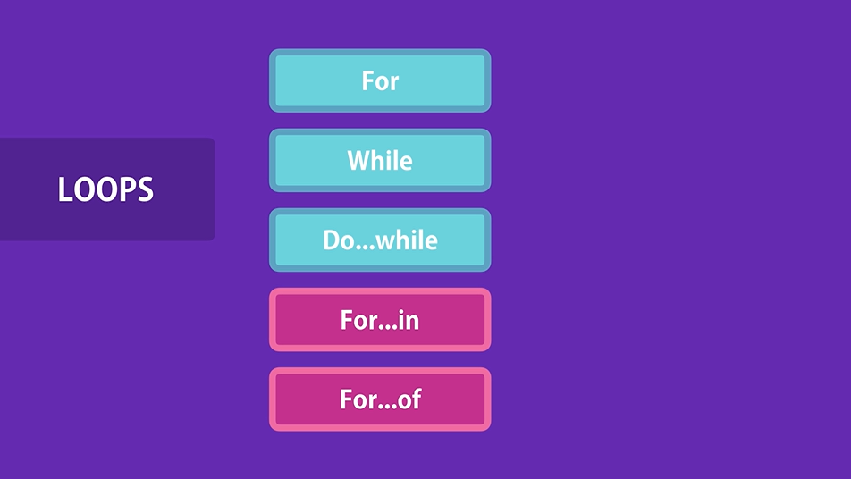

# Control Flow

## If and Else (Conditional Statements)

If the condition is true,the statement will be printed. If we have multiple statements, we wrap them into a curly braces {}.We refer to this as a block of code.

```
if (condition) {
    statement 1
    statement 2
}
```

We can add more condition. If none of the condition is true,we can use else to execute one or more statements

```
if (condition) {
    statement 1
    statement 2
}
else if (another condition){
    statement 3
    statement 4
}
```

```
// If hour is between 6am and 12pm: Display " Good morning!"
// If hour is between 12pm and 6pm: Display " Good afternoon!"
// Otherwise: Good Evening!

let hour = 23;

if (hour >= 6 && hour < 12)
    console.log("Good Morning!")
else if (hour >= 12 && hour <=18)
    console.log("Good Afternoon!");
else
    console.log("Good Evening!");
```

## Switch and case (Conditional Statements)

```
let variable;

switch (variable){
    case value:
        console.log(value);
        break;
    case value:
        console.log(value);
        break;
    case value:
        console.log(value);
        break;
    default:
        console.log();
}
```

```
let role = 'guest';

switch (role){
    case 'guest':
        console.log('Guest User');
        break;
    case 'moderator':
        console.log('Moderator User');
        break;
    default:
        console.log('Unknown User');
}
```

Switch...case VS If...Else
```
let role = 'guest';

switch (role) {
    case 'guest':
        console.log('Guest User');
        break;
    case 'moderator':
        console.log('Moderator User');
        break;
    default:
        console.log('Unknown User');
}

if (role === 'guest')
    console.log('Guest User');
else if (role === 'moderator')
    console.log('Moderator User');
else
    console.log('Unknown user');
```

## For Loops


Sometimes we need to repeat an action a number of time.Let say display "Hello World" 5 times.

```
for (initialExpression; condition; incrementExpression) {
    statement
}
```
The code above will run as long the condition is true.

```
for (let i=0; i<5; i++)
    console.log('Hello World');
```

To display odd numbers
```
for (let i=0; i<10; i++)
    if (i % 2 !==0)
        console.log(i);
```
```
// Boleh jugak kalau nak reverse

for (let i=10; i>0; i--)
    if (i % 2 !==0)
        console.log(i);
```
## While Loops
In for loops,the loops varibales is part of the loops itself. But in while loops,we declare the variables externally.

let i = 0;
while (condition) {
    statement
    incrementExpression
}

```
for (let i=0; i<10; i++)
    if (i % 2 !==0)
        console.log(i);

let i = 0;
while (i<=5) {
    if (i % 2 !==0)
    i++;
}
```

## Do..while loops

similar to while loops but a little bit different

```
let i = 0;
do {
    if (i % 2 !==0) console.log(i);
    i++;
} while (i <= 5) ;
    
// do while loops always will be executed at least once even the condition evaluates to fault because the condition is at the bottom of the scope.

```

## Infinite Loops
Happened when we miss the incrementExpression

## For...in loops
To iterate over the properties of an object
For loops,while loops, do-while loops used for repeating an action a number of time.

We use for...in and for...of to iterate over the propresties of an object or elements in an array.

```
// for -in
const person = {
    name: 'Syakir',
    age: 28
}

for (let key in person)
    console.log(key);
```
## For...of loops

To iterate over an elements or items in an array

## Break and continue
```
let i = 0;
while (i<=10){
    if (1 % 2 === 0) {
        i++;
        continue;
    }

    console.log(i);
    i++
}
```