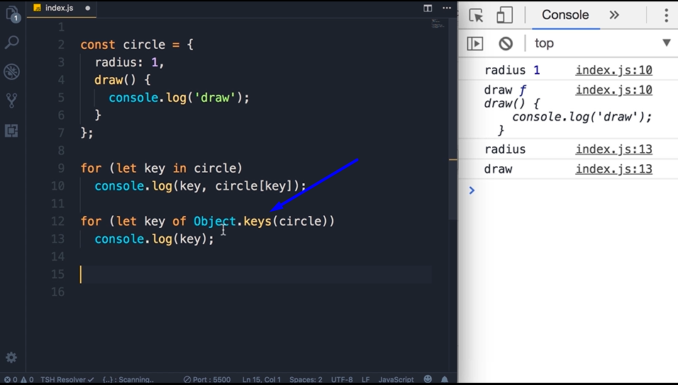
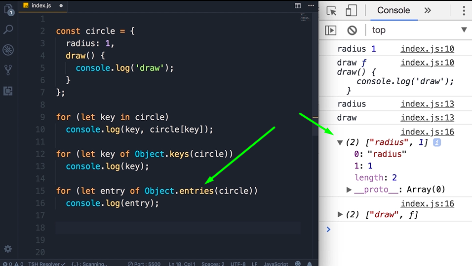

# Objects

## Basics

Objects are collection of key:value pairs.If we have variables properties that are highly related,we want to encapsulated them in an object.

The purpose of objects is to group related variables

```
let radius = 1;
let x = 1;
let y = 1;

// object contain object
const circle = {
    radius: 1,
    location: {
        x: 1,
        y: 1
    }
}
```

```
// object contain another function
const circle = {
    radius: 1,
    location: {
        x: 1,
        y: 1
    }
    draw: function(){
        console.log('draw');
    }
}
```

object properties can be accessed by dot (.) notation

**Object-oriented Programming is a style of programming where we see a program as a collection of objects that talk to each other to perform some functionality.**

when function is in an object it's no longer called function but method of that object.

## Factory Functions

This factory functions produces object

Must put return keyword

In modern Js,if the key and value are the same, we can remove the value and simply adding the key

```
function createCircle(radius){
    return {
        radius,
        draw: function(){
            console.log('draw');
        }
    }
}
```

We can make the code shorter by dropping the function keyword
If we define a function outside an object it would be like this
function draw () {

}

But if we add function inside an object,we can drop the function keyword

```
// From this
function createCircle(radius){
    return {
        radius,
        draw: function(){
            console.log('draw');
        }
    }
}

//to this
function createCircle(radius){
    return {
        radius,
        draw(){
            console.log('draw');
        }
    }
}
```

We define once and run multiple times

```
function createCircle(radius){
    return {
        radius,
        draw: function(){
            console.log('draw');
        }
    }
}

const circle1 = createCircle(1);
console.log(circle1);
```

## Constructor Function

instead of returning a function,we use this.

this. is referencing to the object that executing this piece of code

In Js objects are dynamic, once we create them we can add additional properties or methods to them

```
function Circle(radius) {
    this.radius = radius;
    this.draw = function () {
        console.log('draw');
    }
}

const circle = new Circle(1);
```

When we use new operator, 3 things happen:-

1. This new operators create an empty Js object
2. Then it will set this. operators to the empty object that have been created
3. Finally,that new opeartor will return that new object based on the function
4. Circle is the new object and we set it into a variable named circle to print it on the console

So the difference between Factory and cinstructir functions is :-

1. in fac, when we call a function it will return a new object
2. in constructor, instead of returning an object, we use this. keyword
3. Also differ in the naming convention

## Dyanmic Nature of Objects

Once we create object, we can add properties or methods or removing existing ones.

Eventhough we use const keywords to define a constant, we can simply change and delete properties or methods.

When we use const keyword, that means we cannot reassigned a variable.

```
const circle = {
    radius: 1
}
```

## Constructor Property

Every object in Js, has a property called constructor. And that references the function that was used to construct or create that object.


circle.constructor is a built in constructor in Js

## Functions are objects


Circle is a function,but when we type Circle. all the methods and properties will be displayed.That means functions are also an object


Circle.call ({}, 1) is equal to const another = new Circle(1);
When we use the new operator, that new operator will create an empty object {} and pass them as the first arguments to the call method. And this object will determine the context this. that will reference to {} object. If we dont use the new operator this. will point to the global object which is window. Means that {} specify the target of this.

Another method called apply. It is exactly like the call method but instead of passing all the arguments explicitly, We passed them in an array. This is useful when we have an array somewhere else in our application, and we want to pass the array as the second argument to the apply method.


## values(primitives) Vs reference(object) types


Value examples

x and y are 2 independant variables.

Reference examples


that object is not stored in variable,but in memory.


so when copy x to y, the address is copied, not the value. Both x and y are pointing to the same address in the memory.


## Enumerating Properties of an Object

use square bracket to get the values in a key

```
for (let key in circle)
    console.log(key, circle[key]);
```


We also have for...of loops
this for...of loops can only used in iterables such an array or map. Objects is not iterable.

```
//this will print error on the console
for (let key of circle)
    console.log(key);
```


However we have Object.keys() method that will return an array.


other method beside keys is entries. So instead of returning a key as a string, it return each key value pairs as an array.


Sometimes we want to see if a given object have a given property or method exist.


## Cloning an Object

So we have an object,we create a new object , enumerate and copy from old object to new object.


console.log(another);

The code above is old. In modern Js, we have better ways to achieve the same thing. By using Object.assign method


Object.assign({}, circle); //where {} is an empty object,and circle is the source. We get from the source and place them into the new object. And placed it in a variable.

the object can be empty or not,if not empty it will included alongwith the new object and the copy object from other source.

There is another way that is simpler. We can use spread operator (3 dots)


const another = {...circle} //means that ... copy all properties and methods in circle object and paste it in the curly braces.

## Garbage COllection

Using Low level language like C or C++, when creating an object we need to allocate memory and deallocate memory to it. But in Js,we dont have this concept. At the time we initialize, memory will be automatically allocated for that object, and when done doesnt have to deallocate. This is due to Js hava Garbage Collector.

## String

We have 2 types of string:

1. String Primitives --- string
2. String Object --- String();


So string can accessed as an object and can use multiple properties and methods. Refer documentation.

Escape Notation - easiest way is to use backtick.

## Template Literals

Backtick character ``

This is useful when using email.

We can also add placeholder. using ${}


## Date

Date Object

We can create a date object.

We also can getDate and setDate

ISO format usually used to talk between backend to client server.

