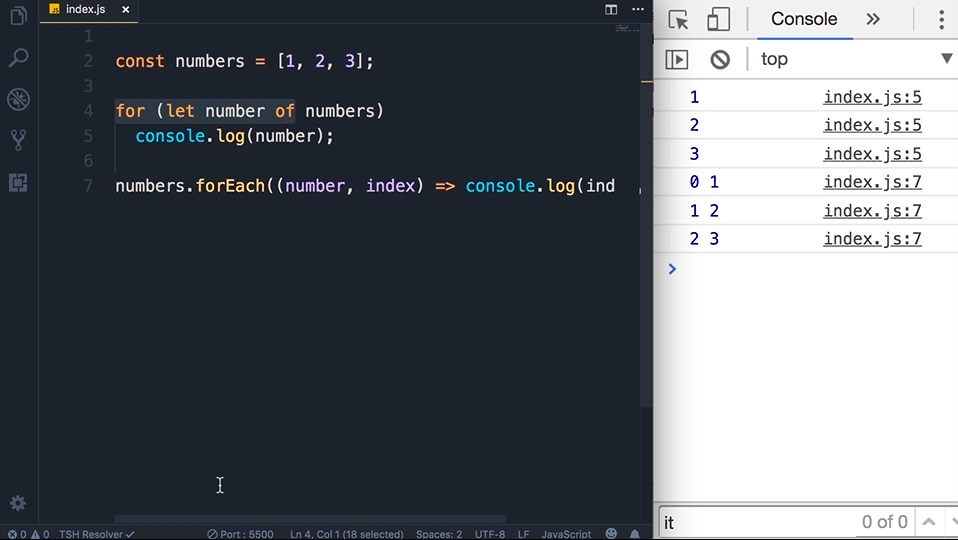
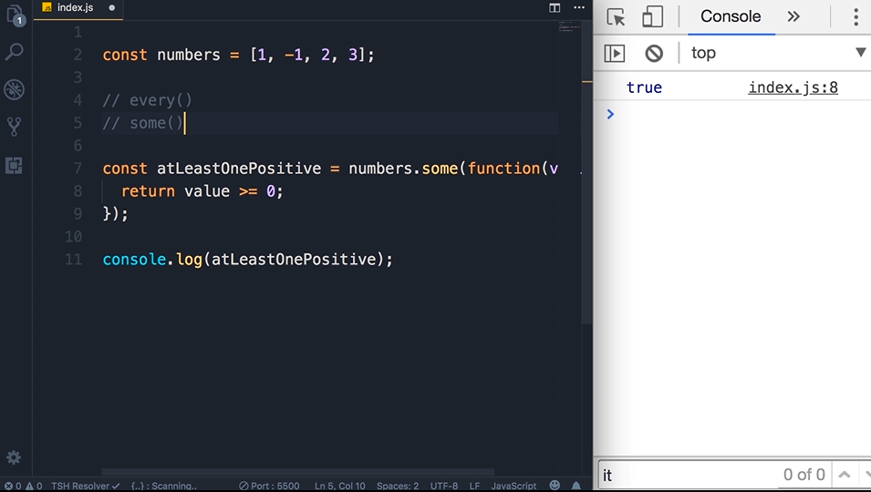
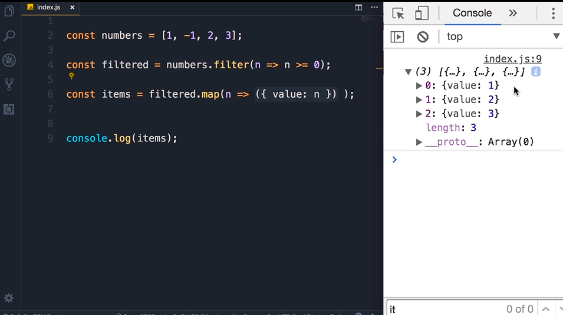

# Arrays

## Adding Elements

When we assign to a const, we cannot reassign to something else.


## Finding Elements (Primitives)
index -1 is false

to see if a given element exist in an array


use include method

## Finding Elements (Reference Type)
use find method


```
const course = courses.find(function(course) {
    return course.name==='a'
});
```

we want to find if we have a course with the name 'a' in the array. That function is a callback function. Because this function is called back to find item in this array

## Arrow Functions
in ES6, we can use arrow function syntax

1. remove the function keyword
2. to separate the parameter between its body, put a fat arrow => in between them
3. If our function have single parameter, we can also delete the paranthese.
4. If we dont have any parameter, we add empty parantheses.
5. If the function is a single line of code, and its returning a value, get rid of the return keyword, remove the curly braces, and put everything in 1 line.

we read as course goes to course.name equal to 'a'
```
const course = courses.find(course =>course.name==='a');
```

## Removing elements
for splice can be used to add or removed items in an array. 


## Emptying an Array

Solution 1


if we reassign an array, garbage collecter will then remove the array later.Because the new array is pointing to a new object. But if we initialize another variables that pointing to the same old array, then the old array will not be removed.

only use array=[]; if we dont have references to the original array. 

for solution 4, when we have large database, that while operations will involve perfomance cost because we call that loops based on numbers of items in that array. 

go for solution 1 or 2


## Combining and Slicing Array
to combine use .concat method
to separate array into 2 parts use .slice method


## The spread operator
in ES6, we have spread operator


## Iterating an Array
can use for...of loops
can also use .forEach(function()) method



## Joining Arrays
Arrays is individual items with different index. so to combine them we use .join method

whenever we see a question mark in the dropdown parantheses (ctrl+space) that means the parameter is optional

similar to .join but not in array but in string we use .split method


## Sorting Arrays


use .sort method. This method converts each element here to a string and sorts the element in the array.

.reverse method to reverse order of method in an array.

Bur for objects,need extra work


dont need to include else because if the first code is true the run will stop if we already put return keyword

head to ASCII table


## Testing the elements of an Array
.every() method


this method will run to every element in this array as soon it find the elements that doesnt match criteria, it will stop searching.


.some() method will search if there is at least 1 element that matches the criteria. As soon it finds an element that returns the criteria it will return true. And the search will terminate

## Filtering an Array
use .filter() method 


We also can use arrow function


## Mapping an Array
use .map() method
we can map elements in array to something else. 


If we returning an object, we put that object in parantheses. 
 

method chaining


Because filter and map method produces new string,we can create a new method on top of the newly created string.


## Reducing an Array
This is 1 way


This is another way by using .reduce() method. Mean if we have 5 elements in array, we want to reduce the 5 numbers into 1 single numbers that is the total numbers or sum of all the numbers.


accumulator equal to let sum=0;
currentValue will be set to each element in numbers array


similar to for loops. 


