# Functions

## Function Declarations vs Expressions
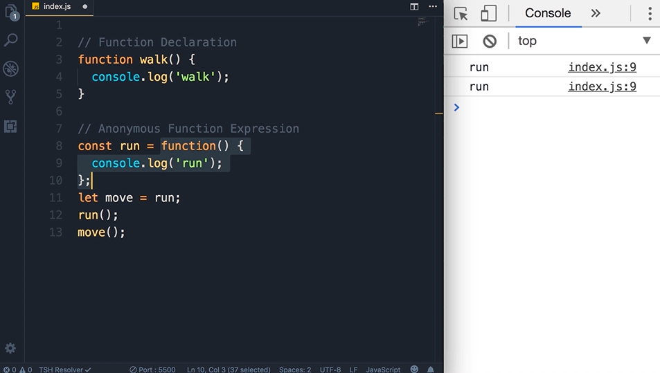

## Hoisting
Hoisting is when Js engine execute the Function Declaration code, it will move the Function Declaration to top, eventhough we call the function before it is defined. That cannot be done in Function Expression

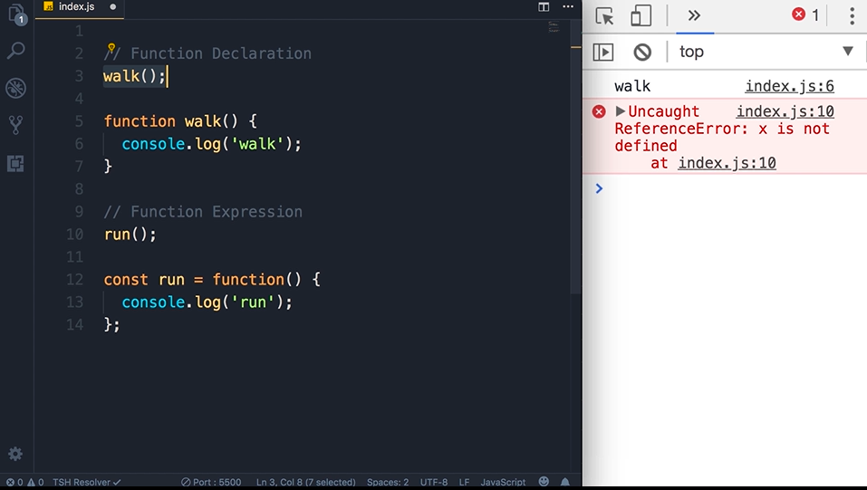

## Arguments
use arguments object.This is useful when we want to use a varying number of paremeters in a function.

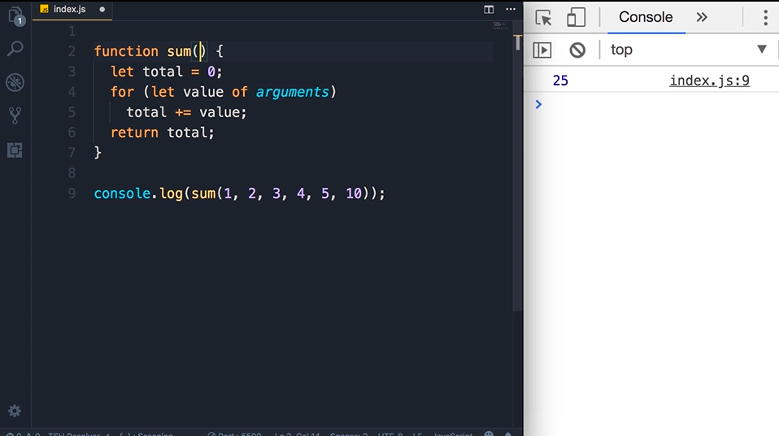


## The Rest Operator
use ...args

when we apply the rest operator to a parameter of a function, we can pass varying number of arguments and the rest operator will take all of them and put them in an array.

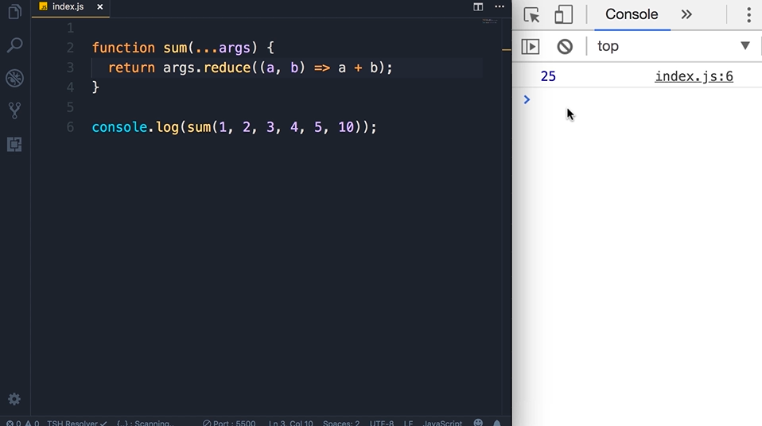

Calculating discount in item cart
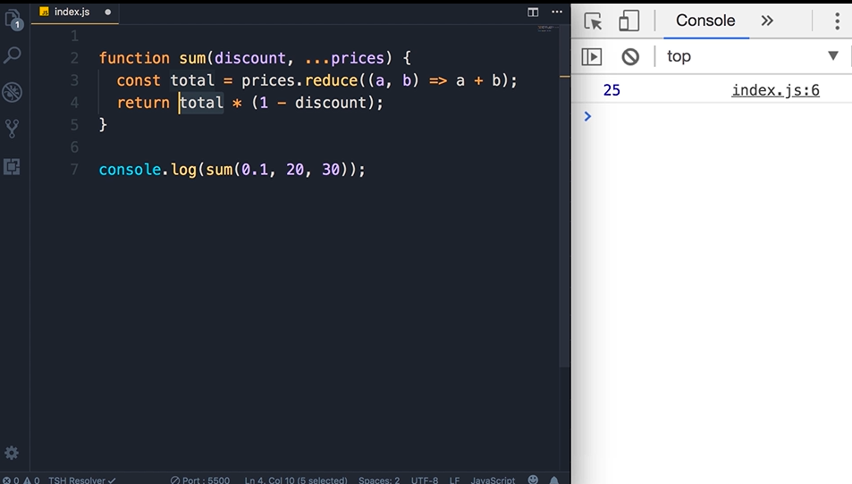

rest ...args must be last formal parameter.

## Default Parameter
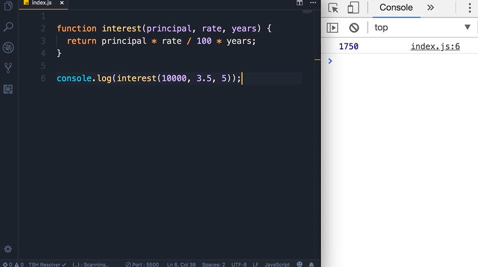

So we want to have a default value for rate, and years. We can achieve thar using logical OR.

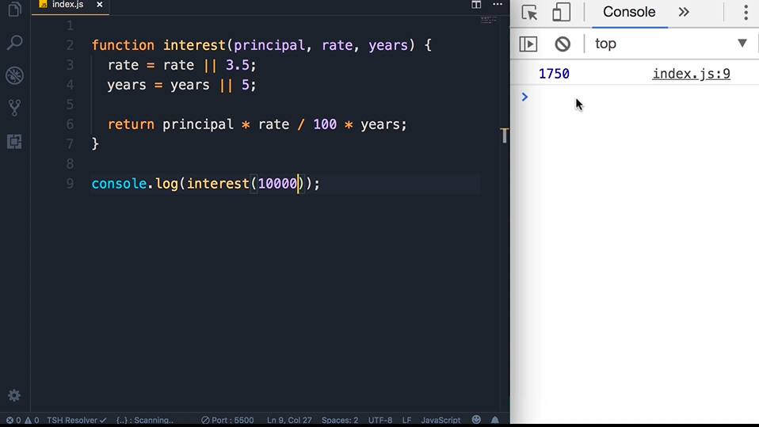

This is a newer way to achieve the same thing introduced in ES6

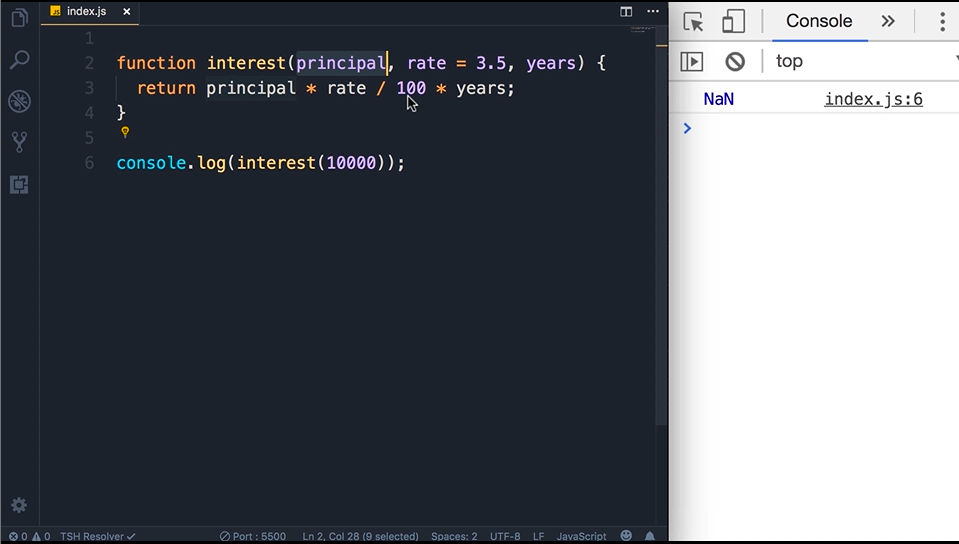

we can pass the value in the parameter,but make sure that it is placed last,or each parameter after that should be initialized to a value as well.

## Getter and Setters
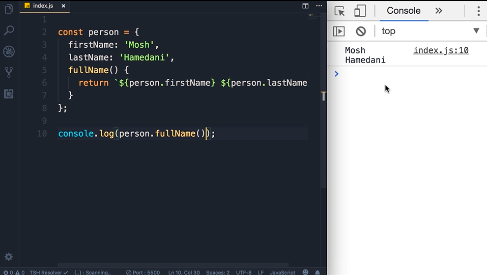

We want to code once, and call that function multiple times in other places. But the way above is read only and we cant change outside of the code block.

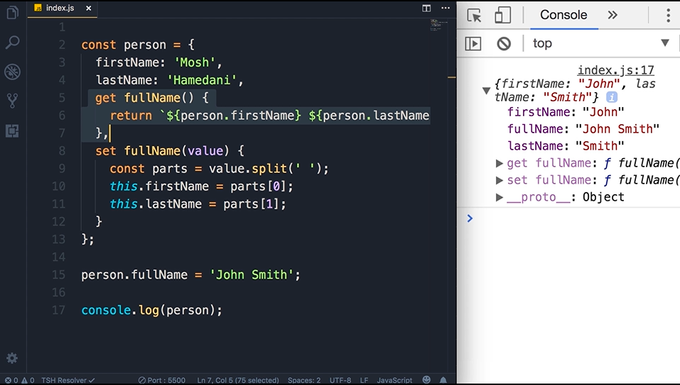

## Try and Catch
Error handling - defensive programming
use throw keyword
we throw the error and catch that error. 

```
const person = {
    firstName: 'Mohd',
    lastName: 'Syakir',
    set fullName(value) {
        if (typeof value !== 'string')
            throw new Error('Value is not a string.');

        const parts = value.split(' ');
        if (parts.length !== 2)
            throw new Error('Enter a first and last name.');

        this.firstName = parts[0];
        this.lastName = parts[1];
    }
}

try {
    person.fullName = '';
}

catch (e) {
    alert(e);
}

console.log(person);
```

## Local Vs Global Scope
avoid define global constant or variables

## Let Vs Var
The issue with the var keyword is that when we declare a variable with var, the scope is not limited to the code block which is it's defined but limited to the function that it's defined.

var => function-scoped
ES6 (ES2015): let, const => block-scoped

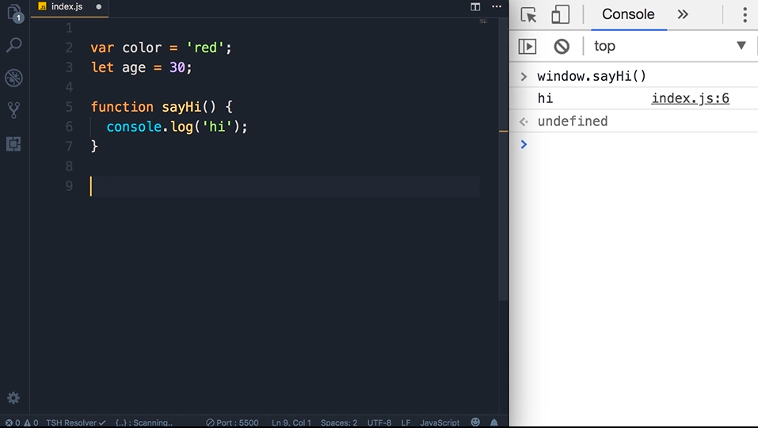

when var is initialized globally, it will be attached to the global window. 

same as the function sayHi() {} in the image. 

